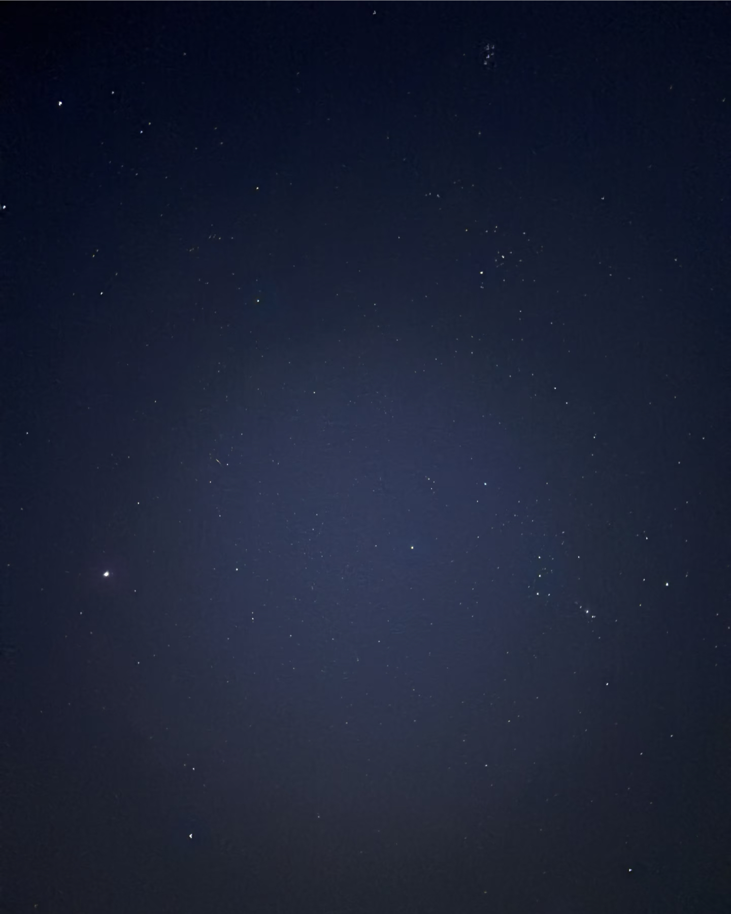
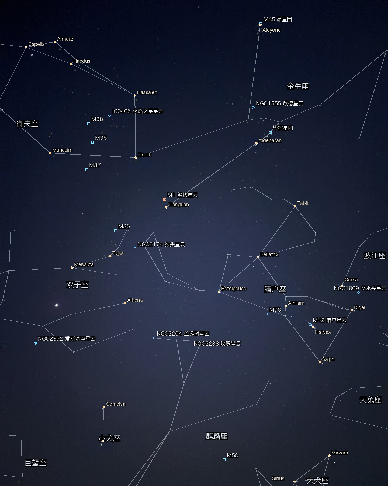

# Star Annotator Demo

A lightweight star-field recognition service built with Bun, Python, and Astrometry.net.

Given a night-sky photo captured from the ground, the service can:

1. Plate-solve the image
2. Query star and deep-sky catalogs
3. Project celestial coordinates back into image space through WCS
4. Draw constellation lines, constellation labels, star names, and deep-sky markers
5. Return structured JSON, with optional server-side rendered output

The project is intentionally simple:

- no scheduled jobs
- no persistent uploads or generated files
- request-scoped temporary processing only
- optional server rendering, or JSON-only output for client-side rendering

## Example

<table>
  <tr>
    <td align="center"><strong>Input</strong></td>
    <td align="center"><strong>Annotated Output</strong></td>
  </tr>
  <tr>
    <td></td>
    <td></td>
  </tr>
</table>

## Highlights

- Upload `JPG`, `PNG`, or `WebP` sky photos
- Automatic plate solving with Astrometry.net
- Named stars, constellation lines, constellation labels, and deep-sky objects
- Multiple overlay presets and fine-grained layer switches
- Request-level locale selection with Stardroid-backed multilingual labels
- `server` render mode: returns a Base64-encoded annotated image
- `client` render mode: returns `overlay_scene` JSON for your own renderer
- No long-term file storage for uploads or generated results

## Stack

- Bun HTTP server
- Python processing pipeline
- [Astrometry.net](https://github.com/dstndstn/astrometry.net)
- Astropy / Skyfield / SEP / Pillow
- Stellarium sky-culture reference data
- Stardroid-derived supplemental constellation and deep-sky reference data
- IAU naming references for constellation and star-name provenance
- Stardroid multilingual locale tables bundled for request-time label selection

## Project Layout

```text
.
├── data/
│   ├── astrometry/        # Large local indexes, intentionally not committed
│   ├── catalog/
│   └── reference/
├── public/
├── python/
├── samples/
├── src/
├── test/
├── Dockerfile
└── README.md
```

## How It Works

The pipeline is:

`image upload -> normalization -> source analysis -> plate solving -> WCS projection -> scene assembly -> optional rendering`

At runtime:

- uploads are written to a temporary directory
- the Python worker or CLI solver reads from that directory
- results are returned as JSON
- any temporary files are removed immediately after the request finishes

Reference and localization provenance is documented in [docs/data-sources.md](./docs/data-sources.md).

## Quick Start

### 1. Install dependencies

```bash
python3 -m venv .venv
source .venv/bin/activate
pip install -r requirements.txt
bun install
```

You also need `solve-field` installed locally.

### 2. Download required data

```bash
bun run bootstrap
```

This fetches:

- Astrometry.net index files `4107` through `4119`
- the minimal catalog cache
- Stellarium reference assets
- bundled sample images

The Astrometry index directory is intentionally excluded from Git because it is large.

### 3. Start the server

```bash
bun run dev
```

Default URL:

- [http://localhost:3000](http://localhost:3000)

Cross-origin API access is enabled by default. To restrict it in production, set `CORS_ALLOWED_ORIGINS` to a comma-separated allowlist such as:

```bash
CORS_ALLOWED_ORIGINS=http://localhost:5173,https://your-app.example bun run start
```

### 4. Production run

```bash
bun run check
NODE_ENV=production bun run start
```

On startup the server will:

1. validate Python and `solve-field`
2. validate required reference files
3. warm the Python worker

## Docker

Build:

```bash
docker build -t star-annotator:local .
```

Run:

```bash
docker run --rm -p 3000:3000 --name star-annotator star-annotator:local
```

If port `3000` is already in use:

```bash
docker run --rm -p 4176:3000 --name star-annotator star-annotator:local
```

Health checks:

```bash
curl http://127.0.0.1:3000/healthz
curl http://127.0.0.1:3000/readyz
```

## Render Modes

`render_mode` supports two values:

- `server`: the backend renders the annotated image and returns it as `annotatedImageBase64`
- `client`: the backend returns recognition data plus `overlay_scene`, leaving rendering to the client

Neither mode stores generated images on disk as durable output.

## Built-in Samples

The server ships with three sample images:

- `apod4` — wide Big Dipper / Ursa Major field
- `orion-over-pines` — real nightscape with foreground trees
- `apod5` — wide winter-sky stress sample

## API Overview

### Static routes

| Method | Path | Description |
| --- | --- | --- |
| `GET` | `/` | Minimal demo page |
| `GET` | `/app.js` | Frontend script |
| `GET` | `/samples/:filename` | Built-in sample images |

### Service routes

| Method | Path | Description |
| --- | --- | --- |
| `GET` | `/healthz` | Liveness probe |
| `GET` | `/readyz` | Readiness probe |
| `GET` | `/api/samples` | List built-in samples |
| `GET` | `/api/overlay-options` | Return default overlay options and presets |
| `POST` | `/api/analyze` | Upload and analyze an image |
| `POST` | `/api/analyze-sample` | Analyze a built-in sample |

## API Details

### `GET /healthz`

Returns service health:

```json
{
  "ok": true,
  "uptimeMs": 2142,
  "activeJobs": 0,
  "workerReady": true,
  "pendingWorkerRequests": 0,
  "config": {
    "maxUploadBytes": 26214400,
    "maxConcurrentJobs": 1,
    "allowCliFallback": true
  }
}
```

### `GET /readyz`

Returns worker readiness.

If the worker is not ready, the server returns `503`:

```json
{
  "ok": false,
  "error": "worker not ready"
}
```

### `GET /api/samples`

Returns the built-in sample list:

```json
[
  {
    "id": "apod4",
    "title": "APOD Big Dipper",
    "filename": "apod4.jpg",
    "url": "https://raw.githubusercontent.com/dstndstn/astrometry.net/master/demo/apod4.jpg",
    "note": "34x24 degree field, suitable for testing the Big Dipper / Ursa Major overlay."
  }
]
```

### `GET /api/overlay-options`

Returns the default overlay configuration, presets, and bundled locale list.

```json
{
  "defaults": {
    "preset": "max",
    "layers": {
      "constellation_lines": true,
      "constellation_labels": true,
      "contextual_constellation_labels": true,
      "star_markers": true,
      "star_labels": true,
      "deep_sky_markers": true,
      "deep_sky_labels": true,
      "label_leaders": true
    }
  },
  "presets": {
    "minimal": {},
    "balanced": {},
    "max": {}
  },
  "localization": {
    "default_locale": "en",
    "available_locales": ["en", "ja", "zh-Hans", "zh-Hant"]
  }
}
```

### `POST /api/analyze`

Uploads a sky image for analysis.

Content type: `multipart/form-data`

| Field | Type | Required | Description |
| --- | --- | --- | --- |
| `image` | `File` | Yes | Uploaded sky image |
| `render_mode` | `string` | No | `server` or `client` |
| `locale` | `string` | No | Preferred label locale such as `en`, `ja`, `zh-Hans`, `fr` |
| `options` | `string` | No | JSON string overriding overlay options |

Example:

```bash
curl -X POST http://127.0.0.1:3000/api/analyze \
  -F "image=@test/input.jpg" \
  -F 'render_mode=server' \
  -F 'locale=ja' \
  -F 'options={"preset":"max"}'
```

### `POST /api/analyze-sample`

Runs the same pipeline against a built-in sample image.

Content type: `application/json`

| Field | Type | Required | Description |
| --- | --- | --- | --- |
| `id` | `string` | Yes | Sample ID |
| `render_mode` | `string` | No | `server` or `client` |
| `locale` | `string` | No | Preferred label locale |
| `options` | `object` | No | Overlay configuration |

Example:

```bash
curl -X POST http://127.0.0.1:3000/api/analyze-sample \
  -H 'Content-Type: application/json' \
  -d '{"id":"orion-over-pines","render_mode":"client","locale":"ja","options":{"preset":"max"}}'
```

## Response Shape

Both `POST /api/analyze` and `POST /api/analyze-sample` return the same kind of payload.

The TypeScript source of truth for the response contract lives in [src/api-types.ts](./src/api-types.ts).

### Common fields

| Field | Type | Description |
| --- | --- | --- |
| `processingMs` | `number` | Total backend processing time |
| `render_mode` | `string` | Effective render mode |
| `localization` | `object` | Requested locale, resolved locale, and available locales |
| `render_options` | `object` | Resolved overlay options used for the run |
| `available_renders.server` | `boolean` | Whether a server-rendered image is included |
| `available_renders.client` | `boolean` | Whether client rendering is possible |
| `inputImageUrl` | `string \| null` | Built-in sample URL, otherwise `null` |
| `annotatedImageBase64` | `string \| null` | Server-rendered image as Base64 |
| `annotatedImageMimeType` | `string \| null` | MIME type of the server-rendered image |
| `overlay_scene` | `object` | Render-ready scene description for client-side drawing |
| `solve` | `object` | Plate-solve result summary |
| `solve_verification` | `object` | Solve verification metrics |
| `visible_named_stars` | `array` | Visible named stars in the frame |
| `visible_constellations` | `array` | Visible constellations in the frame |
| `visible_deep_sky_objects` | `array` | Visible deep-sky objects in the frame |
| `source_analysis` | `object` | Source extraction and crop diagnostics |
| `timings_ms` | `object` | Phase-by-phase timings |

### Server render example

```json
{
  "processingMs": 1843,
  "render_mode": "server",
  "localization": {
    "requested_locale": "ja",
    "resolved_locale": "ja",
    "available_locales": ["en", "ja", "zh-Hans", "zh-Hant"]
  },
  "available_renders": {
    "server": true,
    "client": true,
    "default_view": "server"
  },
  "inputImageUrl": "/samples/apod4.jpg",
  "annotatedImageMimeType": "image/png",
  "annotatedImageBase64": "iVBORw0KGgoAAAANSUhEUgAA...",
  "solve": {
    "center_ra_deg": 165.6,
    "center_dec_deg": 56.3,
    "field_width_deg": 34.1,
    "field_height_deg": 23.8,
    "crop": null
  },
  "overlay_scene": {
    "image_width": 1024,
    "image_height": 768,
    "constellation_lines": [],
    "constellation_labels": [],
    "deep_sky_markers": []
  }
}
```

### Client render example

```json
{
  "processingMs": 1762,
  "render_mode": "client",
  "localization": {
    "requested_locale": "fi",
    "resolved_locale": "en",
    "available_locales": ["en", "ja", "zh-Hans", "zh-Hant"]
  },
  "available_renders": {
    "server": false,
    "client": true,
    "default_view": "client"
  },
  "annotatedImageMimeType": null,
  "annotatedImageBase64": null,
  "overlay_scene": {
    "image_width": 1024,
    "image_height": 768,
    "constellation_lines": [],
    "constellation_labels": [],
    "deep_sky_markers": []
  }
}
```

## Overlay Options

`options` is a JSON object controlling visible layers and detail levels.

### Common fields

| Field | Type | Description |
| --- | --- | --- |
| `preset` | `string` | `minimal`, `balanced`, or `max` |
| `layers.constellation_lines` | `boolean` | Show constellation line segments |
| `layers.constellation_labels` | `boolean` | Show constellation labels |
| `layers.contextual_constellation_labels` | `boolean` | Show more contextual constellation labels |
| `layers.star_markers` | `boolean` | Show star markers |
| `layers.star_labels` | `boolean` | Show star names |
| `layers.deep_sky_markers` | `boolean` | Show deep-sky markers |
| `layers.deep_sky_labels` | `boolean` | Show deep-sky labels |
| `layers.label_leaders` | `boolean` | Show leader lines for labels |
| `detail.star_label_limit` | `number` | Maximum number of star labels |
| `detail.star_magnitude_limit` | `number` | Star magnitude threshold |
| `detail.dso_label_limit` | `number` | Maximum number of DSO labels |
| `detail.dso_magnitude_limit` | `number` | DSO magnitude threshold |
| `detail.show_all_constellation_labels` | `boolean` | Try to show more constellation labels |
| `detail.detailed_dso_labels` | `boolean` | Use more verbose DSO labels |

Example:

```json
{
  "preset": "max",
  "layers": {
    "constellation_lines": true,
    "constellation_labels": true,
    "contextual_constellation_labels": true,
    "star_markers": true,
    "star_labels": true,
    "deep_sky_markers": true,
    "deep_sky_labels": true,
    "label_leaders": true
  },
  "detail": {
    "star_label_limit": 48,
    "dso_label_limit": 64,
    "show_all_constellation_labels": true,
    "detailed_dso_labels": true
  }
}
```

## Environment Variables

| Variable | Default | Description |
| --- | --- | --- |
| `PORT` | `3000` | HTTP port |
| `MAX_UPLOAD_BYTES` | `26214400` | Maximum upload size |
| `MAX_CONCURRENT_JOBS` | `1` | Maximum in-flight jobs |
| `WORKER_JOB_TIMEOUT_MS` | `120000` | Per-request timeout |
| `ALLOW_CLI_FALLBACK` | `true` | Fall back to the CLI solver if the worker fails |
| `PRELOAD_WORKER_ON_STARTUP` | `true` | Warm the Python worker on startup |
| `LOG_REQUESTS` | `true` | Enable request logging |
| `IDLE_TIMEOUT_SECONDS` | `30` | HTTP idle timeout |
| `MAX_REQUEST_BODY_BYTES` | `31457280` | Maximum request body size |

## Notes

- Uploads and generated images are not stored permanently
- Server rendering returns the image inline as Base64
- Client rendering uses `overlay_scene` on top of the original image
- Sample images remain available through `/samples/:filename`
- `data/astrometry/` is large and is intentionally ignored by Git
- Constellation and DSO display labels are loaded from bundled Stardroid XML resources, not hard-coded inside the Python pipeline
- When a locale is unavailable, the service falls back to bundled English labels instead of hand-written translations

## Development Helpers

Run a built-in sample from the terminal:

```bash
bun run src/run-sample.ts apod4
```

Or use the package scripts:

```bash
bun run sample:apod4
bun run sample:apod5
bun run sample:orion
```

These helpers also avoid long-term output storage and print JSON-oriented results to stdout.
